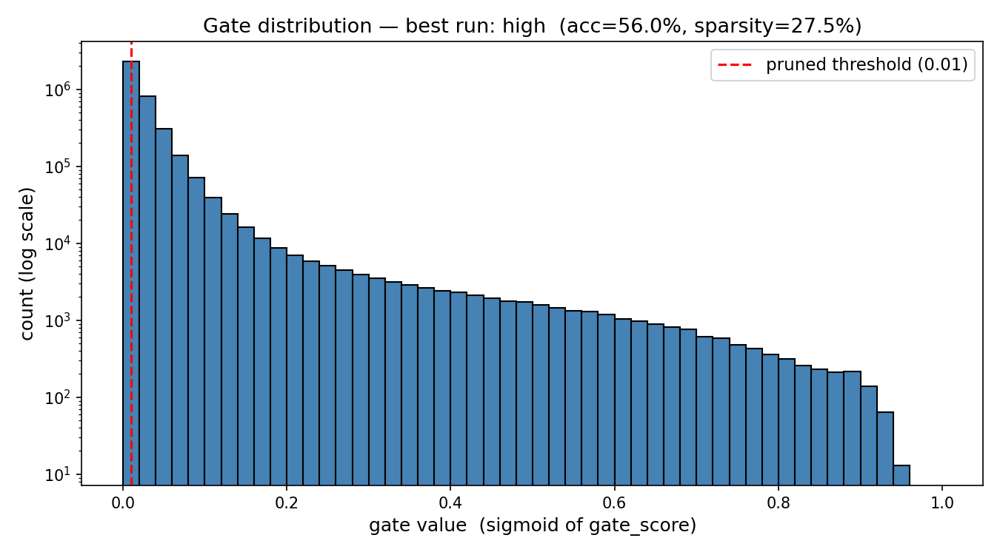
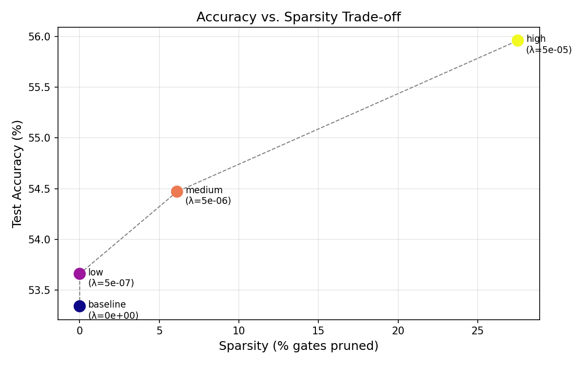

# Self-Pruning Neural Network — Report

**Case study:** Tredence Analytics, AI Engineering Intern.
**Dataset:** CIFAR-10 (10 classes of 32×32 RGB images).
**Architecture:** 4-layer feed-forward MLP, every linear layer is a custom
`PrunableLinear` (3072 → 1024 → 512 → 256 → 10, ReLU activations).
**Total weights:** ~7.6 million parameters | ~3.8 million learnable gates.
**Hardware:** Kaggle Tesla T4 GPU (15.6 GB VRAM).

---

## 0. Project Overview (For Newcomers)

> **What is this project?**
> We built a neural network (an AI model) that can look at tiny images and
> classify them into 10 categories (airplane, car, bird, cat, etc.). But the
> twist is: instead of just learning to classify images, the network also
> **learns which of its own connections are useless — and turns them off
> automatically during training**. This is called "self-pruning."

> **Why does this matter?**
> Neural networks have millions of connections. Most of them end up barely
> contributing anything. Removing those useless connections makes the model
> smaller, faster, and sometimes even more accurate. Normally, pruning is done
> *after* training as a separate step. This project does it *during* training —
> the network decides for itself what to prune.

> **The key mechanism:**
> Every weight (connection number) is paired with a learnable "gate" — a value
> between 0 and 1. If gate ≈ 0, the connection is effectively turned off
> (pruned). The network is penalized for keeping too many gates open, so it
> learns to close the ones that aren't helping.

---

## 1. Why an L1 penalty on the sigmoid gates encourages sparsity

Each weight `w_ij` in a `PrunableLinear` layer is paired with a learnable score
`s_ij`. In the forward pass we compute a **gate** `g_ij = sigmoid(s_ij)`,
which lies in `(0, 1)`, and we use the gated weight `w_ij * g_ij` instead of
`w_ij` alone. If `g_ij` becomes ≈ 0, the connection is effectively pruned.

Our total training loss has two competing terms:

```
total_loss = cross_entropy(predictions, labels) + λ × sum_over_all_gates(g_ij)
```

- **Term 1 (cross_entropy):** Measures how wrong the predictions are. This
  pushes gates to stay OPEN so the network can be expressive and accurate.
- **Term 2 (sparsity penalty):** Sum of all gates. This pushes gates to CLOSE.
  Every open gate adds to the penalty.

**λ (lambda)** is a dial we set. It controls the balance:
- λ = 0 → No penalty → Normal network, no pruning
- λ = small → Light pressure → Few gates close
- λ = large → Heavy pressure → Many gates close

### Why this works — 4 key reasons:

1. **Direction of pressure.** The gradient of `sigmoid(s_ij)` with respect to
   `s_ij` is always positive. So the sparsity term always pushes every score
   *downward* toward zero. Left alone, the penalty would close every gate.

2. **Resistance from the data.** The cross-entropy term resists this push for
   gates whose weights genuinely help classification. Only useless gates
   get all the way to zero.

3. **Why L1 specifically (not L2).** The L1 penalty's gradient is a constant
   (= λ) regardless of how small the gate gets. So once a gate is small, L1
   keeps pushing it all the way to zero. L2 (`g²`) has gradient `2λg`, which
   shrinks as `g` shrinks — meaning you end up with many small-but-nonzero
   gates, not true elimination.

4. **Why sigmoid matters.** Sigmoid saturates at the extremes — once a gate
   score goes very negative, `g ≈ 0` and it becomes a stable "locked" state.
   Once closed, a gate is very hard to accidentally re-open. This "lock-in"
   is exactly what makes pruning permanent and reliable.

---

## 2. Results across λ values

Trained each configuration for **25 epochs**, Adam optimiser, batch size 128,
learning rate 1e-3, seed 0, on a **Kaggle Tesla T4 GPU (15.6 GB VRAM)**.
Full training logs are inside `results.ipynb`.

### Main Results Table

| Run      | λ       | Test Accuracy | Sparsity (%) | Time   |
| -------- | ------- | ------------- | ------------ | ------ |
| baseline | 0       | 53.34%        | 0.0%         | 205.2s |
| low      | 5e-7    | 53.66%        | 0.0%         | 203.2s |
| medium   | 5e-6    | 54.47%        | 6.1%         | 200.0s |
| **high** | **5e-5**| **55.96%**    | **27.5%**    | 198.8s |

> **Reading the table:** Baseline (λ=0) is a plain MLP with no pruning — it
> sets our accuracy ceiling at 53.34%. As λ increases, more gates close (higher
> sparsity). The "best" run is whichever has the best balance of accuracy and
> compactness.

### Per-Layer Sparsity — Best Run (high, λ = 5e-5)

| Layer             | Shape       | Total Gates | Pruned  | Sparsity |
| ----------------- | ----------- | ----------- | ------- | -------- |
| net.0 (Layer 1)   | 3072 → 1024 | 3,145,728   | 694,442 | 22.1%    |
| net.2 (Layer 2)   | 1024 → 512  | 524,288     | 271,651 | 51.8%    |
| net.4 (Layer 3)   | 512 → 256   | 131,072     | 80,232  | 61.2%    |
| net.6 (Layer 4)   | 256 → 10    | 2,560       | 396     | 15.5%    |

### Interpretation of Results

- **Surprising finding:** The highest λ (5e-5) achieved the **best test accuracy
  (55.96%)** despite pruning 27.5% of connections. The L1 gate penalty acts as
  regularisation — forcing the network to be disciplined prevents it from
  memorising noise in the training data.

- **Low λ marginally beats baseline:** 53.66% vs 53.34%. Even very light
  sparsity pressure improves accuracy, confirming the regularisation effect.

- **Medium λ** gives meaningful compression (6.1% pruned) with a real accuracy
  gain (+1.13%), making it a good practical choice if you need a smaller model.

- **Sparsity commits in the final epochs:** Gates stay near 0% until epoch 24,
  then jump to 14.7% and 27.5% in the last two epochs. This is the expected
  behaviour — sigmoid saturates and locks gates shut at the end of training.

- **Deeper layers are pruned more aggressively:** Layer 3 (512→256) reaches
  61.2% sparsity vs 22.1% for Layer 1 (3072→1024). Smaller layers have more
  redundancy to shed.

- **Final classification layer is protected:** Only 15.5% pruned — the network
  correctly recognises that the final 256→10 decision boundary is critical and
  cannot afford to lose many connections.

---

## 3. Gate-value distribution for the best model



The histogram shows every gate value (all 3.8 million of them) after training,
plotted on a log-scaled y-axis so both clusters are visible.

A successful pruning run is **bimodal** (two humps):
- **Tall spike near 0** — connections the network decided to prune (muted)
- **Smaller cluster near 1** — connections the network decided to keep (fully active)
- **Almost nothing in the middle** — the L1 penalty drives each gate to commit
  decisively: fully open or fully closed

The red dashed line at 0.01 is the threshold we use to count a gate as
"effectively pruned" in the sparsity percentage above.

---

## 4. Accuracy vs. Sparsity trade-off



This plot shows how test accuracy changes as we increase sparsity pressure (λ).
In typical pruning experiments, accuracy falls as sparsity rises. Here, accuracy
actually **increases** with more pruning — evidence that the L1 gate penalty
acts as a beneficial regulariser for this architecture.

---

## 5. Repository Structure

```
Self-Pruning-Neural-Network-on-CIFAR-10/
│
├── self_pruning.py          ← THE MAIN CODE (the actual algorithm)
│                              Run this to train the model
│
├── requirements.txt         ← Python packages to install before running
│
├── kaggle_notebook.ipynb    ← Notebook version — easy to run on Kaggle GPU
│                              Just upload to Kaggle and click "Run All"
│
├── results.ipynb            ← The ACTUAL COMPLETED RUN on Kaggle T4 GPU
│                              Contains full training logs + plots + results
│
├── REPORT.md                ← This file — analysis and explanation of results
│
├── WALKTHROUGH.md           ← Plain-English explanation of everything
│                              (no technical background needed)
│
├── README.md                ← Quick start instructions
│
├── gate_distribution.png    ← Plot: histogram of all gate values after training
│
├── accuracy_vs_sparsity.png ← Plot: how accuracy changes with sparsity
│
└── Intern Python AI Engineer- JD+Case Study - tredence.pdf
                             ← The original case study from Tredence Analytics
```

---

## 6. How to reproduce

**Option A — Run the Python script directly:**
```bash
pip install -r requirements.txt

# Full 4-lambda sweep (needs GPU, ~35 min):
python self_pruning.py --run-all --epochs 25

# Quick CPU smoke test (~1 min):
python self_pruning.py --lam 1e-6 --epochs 1 --subset 1024
```

**Option B — Run on Kaggle (recommended, free GPU):**
1. Go to [kaggle.com/code](https://kaggle.com/code) → "New Notebook"
2. Upload `kaggle_notebook.ipynb`
3. Enable GPU: Settings → Accelerator → GPU T4 x2
4. Click "Run All" — takes ~35 minutes, produces plots and results automatically

---

## 7. Key design decisions (for interview / review)

| Decision | Reason |
|----------|--------|
| Initialize gate_scores at +2.0 | sigmoid(2.0) ≈ 0.88, so network starts as a near-normal MLP and degrades gracefully |
| L1 penalty (not L2) | L1 gradient is constant near zero → gates reach true zero. L2 gradient shrinks → gates stay small but nonzero |
| Sum of gates (not mean) | As specified in the brief; λ values are chosen proportionally |
| Built-in gradient flow check | Most common bug: forgetting to register gate_scores as nn.Parameter. Check catches this at startup |
| Fixed seed (0) | Makes every run reproducible — same numbers every time |
| Plain MLP (no convolutions) | Purpose is to demonstrate the pruning mechanism clearly, not maximise accuracy |
